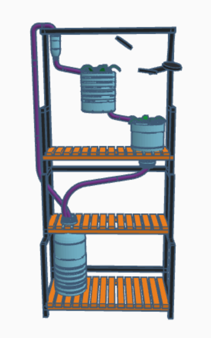
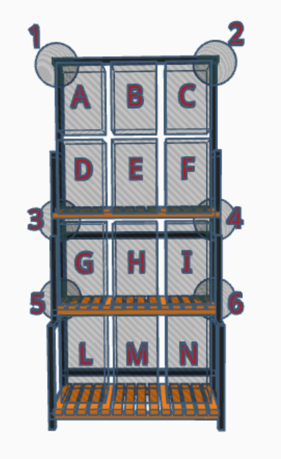
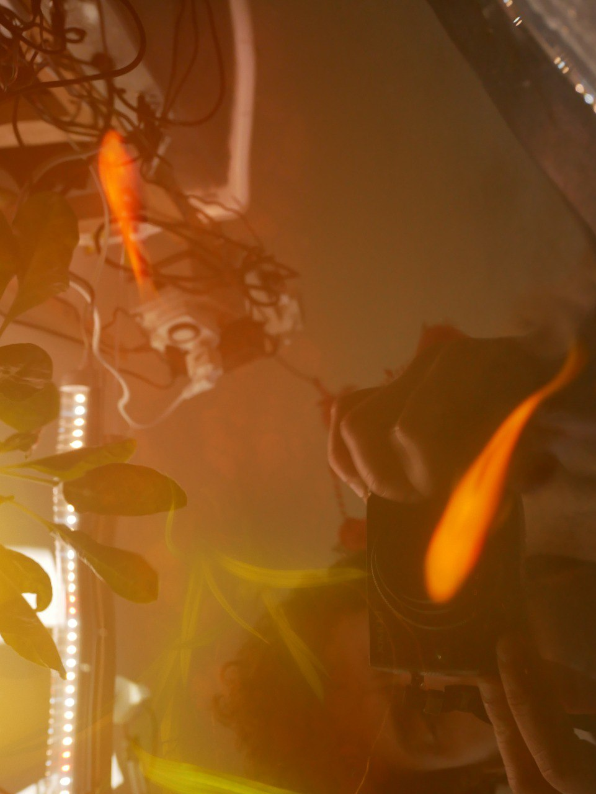

# aquaponics-greenhouse
an online repository to save and edit some how-tos about the modular aquaponics greenhouse project held by Officine Innesto since July 2022

TODO: made the repository bi-lingual 

## Intro

La Serra Aquaponica Didattica prevede l'utilizzo di vari moduli che compongono diverse soluzioni per il mantenimento dell'ecosistema serra. 

I moduli (elencati più sotto) possono essere di diversa fattura, ma l'idea del prodotto minimo é quella di usare piccole cisterne di acqua da 18L-22L inserite dentro un mobile a tre livelli. 

Un primo semplice rendering del progetto lo si può vedere qui, il progetto serra verrà fotografato / riprodotto in forma stabile a metà settembre 2023. 

## Unità Didattiche:

* **Costruzione della Serra Acquaponica Didattica**, 8h  
* **Introduzione all’IoT attraverso l’uso della Serra**, 4 - 8 o 16 h  
* **Manutenzione e Gamification del progetto**: il ciclo dell’acqua, il filtro biologico,  il primo pesce, la crescita delle piante e delle prime verdure (4h di persona più formazione a distanza da definire) 
* **Showcase dell’esperienza**: la serra ed il team di Officine è ospitato presso un evento e spiega le possibilità di questo strumento didattico, e di come costruirselo. Orario Variabile 

## Team 

Giacomo Bellini, Agronomist
Davide Gomba, PM, formatore IoT, 

Per informazioni: edu@officine.cc 

## Approccio Modulare 

## Moduli Serra

1)  Modulo letto di crescita  
2)  NFT Orizzontale  
3)  NFT Verticale  
4)  Modulo Acquario Verticale  
5)  Modulo Acquario Orizzontale  
6)  Modulo Cibo Vivo  
7)  Modulo Filtro Biologico  
8) Contenitore di analisi  

### 1) Modulo letto di crescita

un letto di crescita é composto da
1) mezzo bottiglione tagliato
2) un lampada da 45W
3) **uno scarico continuo (normale o a tappo)** o a **"campana" (da trovare stampabile in 3d)**
4) **un tubo "troppo-pieno"**
5) 3 gocciolatori
6) **sostegni e agganci** 
7) argilla espansa e lapillo vulcanico
8) tubo nero

### 2)  NFT Orizzontale

modulo NFT lineare é composto da
1) due tubi 6x12x50 (tagliati a metà)
2) **due angoli di ingresso** (link all'stl) 
3) **due angoli di uscita** (link all'stl)
4) 5-6 cestini
5) un lampada da 45W
6) **sostegni e agganci** 

### 3)  NFT Verticale

modulo NFT lineare é composto da
1) due tubi 6x12x50 (tagliati a metà)
2) **due angoli di ingresso** (link all'stl) 
3) **due angoli di uscita** (link all'stl)
4) 5-6 cestini
5) un lampada da 45W
6) **sostegni e agganci** 

Elementi nuovi 
[china 1](https://www.aliexpress.us/item/3256805231872089.html?spm=a2g0o.detail.0.0.46ccDXtGDXtGwB&gps-id=pcDetailTopMoreOtherSeller&scm=1007.40050.281175.0&scm_id=1007.40050.281175.0&scm-url=1007.40050.281175.0&pvid=a844479e-ba1c-4d4b-bf85-db9159753253&_t=gps-id:pcDetailTopMoreOtherSeller,scm-url:1007.40050.281175.0,pvid:a844479e-ba1c-4d4b-bf85-db9159753253,tpp_buckets:668%232846%238113%231998&pdp_npi=3%40dis%21EUR%212.07%211.03%21%21%21%21%21%40211b619a16899530811687798e5c1f%2112000032982355334%21rec%21US%21723369429)
[china 2](https://www.aliexpress.us/item/3256804894188768.html?spm=a2g0o.detail.0.0.46ccDXtGDXtGwB&gps-id=pcDetailTopMoreOtherSeller&scm=1007.40050.281175.0&scm_id=1007.40050.281175.0&scm-url=1007.40050.281175.0&pvid=a844479e-ba1c-4d4b-bf85-db9159753253&_t=gps-id:pcDetailTopMoreOtherSeller,scm-url:1007.40050.281175.0,pvid:a844479e-ba1c-4d4b-bf85-db9159753253,tpp_buckets:668%232846%238113%231998&pdp_npi=3%40dis%21EUR%218.98%218.08%21%21%21%21%21%40211b619a16899530811687798e5c1f%2112000031565986637%21rec%21US%21723369429)

### 4) Modulo Acquario Verticale

1) bottiglia da 18L
2) mangiatoia per pesci
3) pompa (12v o 5V)
4) ossigenatore
5) lapillo vulcanico
6) pesci e altri animali
7) **tappo per fare entrare acqua e tubi**

### 5)  Modulo Acquario Orizzontale

1) bottiglia da 18L
2) mangiatoia per pesci
3) pompa (12v o 5V)
4) ossigenatore
5) lapillo vulcanico
6) pesci e altri animali
**7) tappo per fare entrare acqua e tubi**

### 6)  Modulo Cibo Vivo

1) bottiglia da 18L
2) mangiatoia per pesci
3) ossigenatore
4) lapillo vulcanico
5) pesci e altri animali
6) **tappo per fare entrare acqua e tubi**

### 7) Modulo Filtro Biologico

1) **contenitore almeno da 5L (o scura, tanica, tipo da benzina)**
2) bio-balls
3) ossigenatore
4) attivatori biologici

### 8) Contenitore di analisi

**1) sonda ph**
2) sonda ec
3) **wio terminal / MCU / schedina nostra** (capire Arturo)
	1) alimentazione per la pompa
	2) alimentazione per la mangiatoia
	3) (opzionale) piccolo UPS
	4) alimentazione luci 
	5) vari buck converters
4) potenziometro per regolare velocità della pompa (che diventerà PWM)
5) **anlizzatore di consumi**
6) Aliemntatore 220V --> 12V bello pesante di pamperaggio
7) va